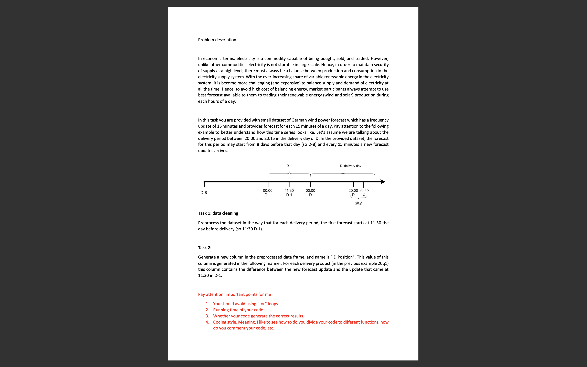

# Data-preproceesing
Data preprocessing using pandas.This project was done by me for an interview,where the data pre proceesed according
to the problem statement
The code is done in the tasker.py file and the intial csv file is test_data.csv. The data after pre proccesing is found at final.csv file.
<b>Problem Statement</b>  

